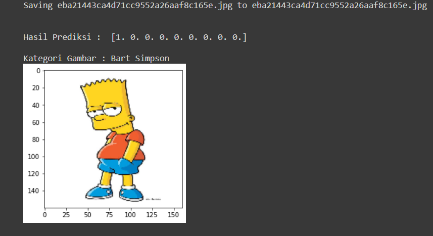

 

  

 

---

 

  

<h2 align="center">Machine Learning Developer</h2>

Modul Completed

1. Belajar Dasar Visualisasi Data [[📃](https://www.dicoding.com/academies/177)]

    

2. Memulai Pemrograman Dengan Python [[📃](https://www.dicoding.com/academies/86)]

    

3. Belajar Machine Learning untuk Pemula [[📃](https://www.dicoding.com/academies/184)]

    

    

Project

    - Image Classification [[📁](https://github.com/rifqinvnd/Dicoding/blob/main/Project/RockPaperScissors-ImageClassification.ipynb)]

        
      
4. Belajar Pengembangan Machine Learning [[📃](https://www.dicoding.com/academies/185)]

    

    

Project

    - BBC News Categories Classification [[📁](https://github.com/rifqinvnd/Dicoding/blob/main/Project/BBCtextcategories-NLP.ipynb)]

        

    - China Temperature Time Series Forecating [[📁](https://github.com/rifqinvnd/Dicoding/blob/main/Project/ChinaTemperature-TimeSeriesForecasting.ipynb)]

        

    - The Simpson Character Classification [[📁](https://github.com/rifqinvnd/Dicoding/blob/main/Project/TheSimpsonCharacter-ImageClassification.ipynb)]

        
  
    

---
 

  

<h2 align="center">Cloud and Back-End Developer</h2>

Modul Completed

1. Cloud Practitioner Essentials (Belajar Dasar AWS Cloud) [[📃](https://www.dicoding.com/academies/251)]

    
